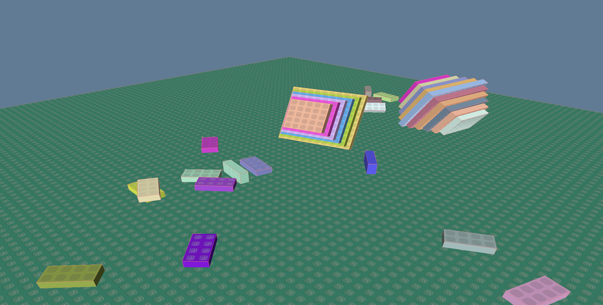

### Freebricks 

Freebricks is a project towards creating an open source full-stack brick-building game and website. 

It is currently highly in development and a collection of demos. Do not expect anything soon. 

Short-term Roadmap:

- Support scenes of around 2^16-2^17 bricks 
- Rendering techniques that are GPU-based (compute culling) and CPU-based (brick culling via. BVH/Octree)
- Handling basic shapes and meshes with batched rendering. 
- Shadow maps 
- Robust physics system 
- Player controls/Camera/IMGUI 

Extremely Broad (And Unrealistic) Roadmap: 

- Quic/UDP Networking 
- Site through Ruby on Rails with HTMX/js frontend 
- Headless Avatar Rendering with REST api through RabbitMQ 
- luau scripting
- And much, much, more. 

### Contributing 

I am still figuring out theoretical implementations of areas such as network optimization, backend web programming and avatar rendering. If you have a passion for brick-building forum sites and open source, please shoot me an email at <konchoknamgyalkunsal@gmail.com> and we can discuss goals.